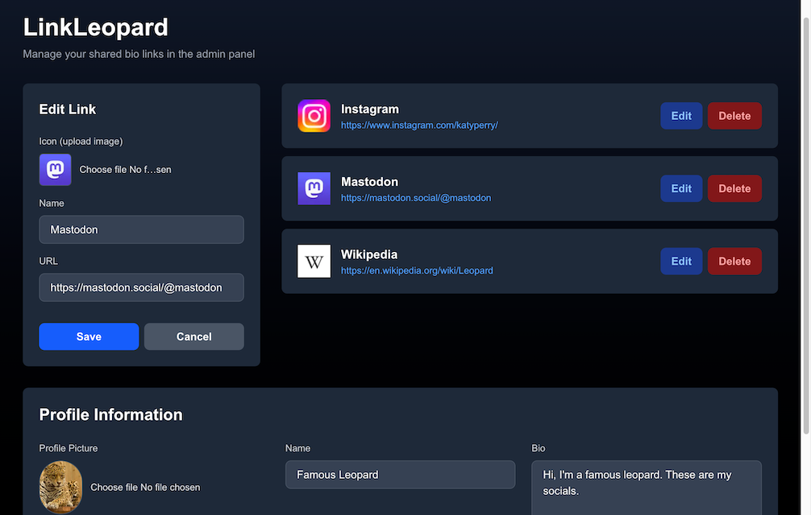

<h1 align="center">LinkLeopard</h1>
<p align="center">Your link-in-bio hub - customize, share, and own your digital presence in one place</p>

<p align="center">
    <a href="https://github.com/jarne/linkleopard/blob/main/package.json">
        
    </a>
    <a href="https://github.com/jarne/linkleopard/actions/workflows/lint.yml">
        
    </a>
    <a href="https://github.com/jarne/linkleopard/actions/workflows/docker-build.yml">
        
    </a>
    <a href="https://github.com/jarne/linkleopard/blob/main/LICENSE">
        
    </a>
</p>

## 📙 Description

**LinkLeopard** puts you in control of your online presence with a **self-hosted link-in-bio page**. Easily add, edit, and organize your links—whether for social media, projects, or contact info—all through a **user-friendly admin interface**.

Smart features like **automatic icon and name fetching** save you time: just paste a URL, and LinkLeopard pulls in the details. Prefer a personal touch? **Customize names and upload your own icons** to match your style.

Your links, your rules—**no third-party hosting, just your brand**.

### Screenshots




## 🖥 Usage

### Docker Compose

The recommended way to deploy LinkLeopard is using Docker. There is a ready-to-use
example [Docker Compose file](./docker-compose.yml) available in this repository.

With [Docker installed](https://docs.docker.com/engine/install/), you can use the following
commands to clone the repository and run Toohga using Docker Compose.

First, clone the repository.

```sh
git clone https://github.com/jarne/linkleopard.git
cd linkleopard
```

Replace the secret values in the `docker-compose.yml` file before continuing to run the application.

Finally, start the services using Docker Compose.

```sh
sudo docker compose up
```

### Manual deployment

Alternative deployment methods are to use the [Docker](./Dockerfile) image or deploy the
Node.js application directly on the operating system.

When deploying without the Docker file, keep in mind to install Node.js and required dependencies using pnpm:

```
pnpm install
```

### Environment variables

The following environment variables need be set:

| Env variable         | Default Value | Description                                                            |
| -------------------- | ------------- | ---------------------------------------------------------------------- |
| `NODE_ENV`           | `development` | Set to deployment environment (`production` or `development`)          |
| `SESSION_PASSWORD`   |               | Secret for session management, random string longer than 32 characters |
| `APP_LOGIN_PASSWORD` |               | Admin password to log-in in the admin web interface                    |

In addition, the following _optional_ environment variables can be set:

| Env variable          | Default Value   | Description                                             |
| --------------------- | --------------- | ------------------------------------------------------- |
| `DB_FILE_NAME`        | `file:local.db` | SQLite file name, in the format `file:/path/to/file.db` |
| `SESSION_COOKIE_NAME` | `ll_session`    | Name of the authentication session cookie               |

## ⌨️ Development

LinkLeopard is based on the Next.js framework and written in TypeScript. On the data layer, Drizzle is used as a ORM
with a SQLite database.

The front-end of the application is based on React and uses Tailwind CSS for styling.

Using the following command, the application can be started for development: `pnpm run dev`

The following checks should be run before commiting code to run ESLint and format the code according
to the defined code style:

```sh
pnpm run lint
pnpm run format
```

## 🙋‍ Contribution

Contributions are always very welcome! It's completely equal if you're a beginner or a more experienced developer.

Thanks for your interest 🎉👍!

## 👨‍⚖️ License

[MIT](https://github.com/jarne/linkleopard/blob/main/LICENSE)
